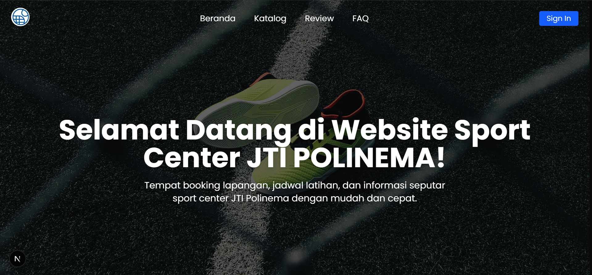
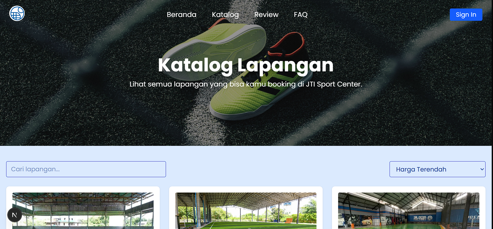
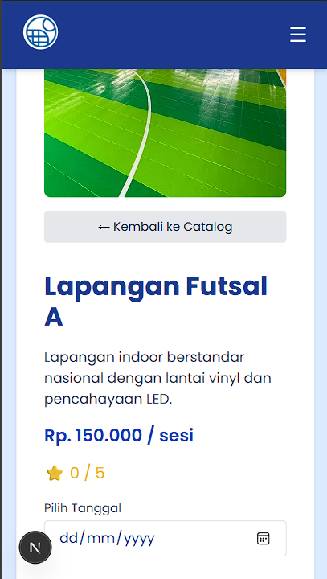
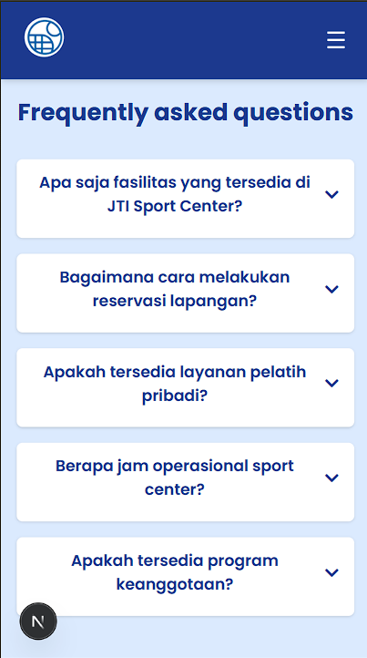

# RESERVASI LAPANGAN SPORT CENTER (JTI Sport Center)

## Logo


## Overview

### Landing Page



### Katalog



### Responsive Mobile

<div style="display: flex; gap: 10px;">
  
  
  
</div>

## Tim Pengembang

<div style="display: flex; gap: 10px; margin-bottom:20px;">
  
  
  
  
  
</div>

- Alifia Bilqi Firajulkha (2241720024)
- Ellois Karina Handoyo (2241720154)
- Juan Felix Antonio Nathan Tote (2241720042)
- Mochamad Imam Hanafi (2241720151)
- Zhubair Abhel Frisky Maulana Zidhane (2141720248)

## Deskripsi Proyek

Aplikasi web untuk sistem reservasi lapangan olahraga di Sport Center JTI Polinema.

## Teknologi yang Digunakan

<div style="display: flex; gap: 10px; flex-wrap: wrap; margin: 20px 0;">
  
  
  
  
  
  
</div>

## Tools

<div style="display: flex; gap: 10px; flex-wrap: wrap;">
  
  
  
  
  
  
  
  
  
</div>

## Persyaratan Sistem

- Node.js (versi 18.x atau lebih baru)
- npm atau yarn
- Git
- Database (sesuaikan dengan konfigurasi Prisma)
- Laragon / XAMPP (Run PhpMyAdmin)

## Cara Menjalankan Proyek

### 1. Clone Repository

```bash
git clone [URL_REPOSITORY]
cd Reservasi-Lapangan-Sport-Center
```

### 2. Install Dependencies (Node.js)

```bash
npm install
# atau
yarn install
```

### 3. Konfigurasi Environment

1. Buat file `.env` di root proyek (untuk Prisma) dan sesuaikan dengan konfigurasi berikut:

   ```env
   DATABASE_URL="[URL_DATABASE_ANDA]"

   CONTOH:
   DATABASE_URL="mysql://[dbuser]:[dbpass]@[dbhost]:3306/[namadb]"
   ```

2. Buat file `.env.local` di root proyek (untuk MySQL + Login) dan sesuaikan dengan konfigurasi berikut:

   ```env.local
   # CONN_DB
    DB_HOST=[dbhost]
    DB_USER=[dbuser]
    DB_PASS=[dbpass]
    DB_NAME=[dbname]

    # JWT SECRET
    JWT_SECRET=[nama_bebas_sebagai_kunci]
   ```

### 4. Setup Database

1. Buat Database MySQL (phpmyadmin) -> Nama DB (Bebas) -> **Buat Database Baru supaya tidak tabrakan!**

2. Run Migrasi + Seeder PRISMA

   ```bash
   npx prisma migrate reset
   ```

   - Peringatan:

     Jika di local banyak data saat development, **Jangan Migrate Reset jika tidak ingin kehilangan data selain di Seeder**, karena sistemnya akan mereset semua data dan mengulangi kembali migrasi + seeder Prisma!

   - Saran:

     Tambah atau ubah saja isi seeder supaya aman untuk `migrate reset`, tapi akan tetap hilang data jika memasukkan data didalam CRUD, jadi ingat!!

3. Ingin Update Model dan Seeder PRISMA

   -> Pergi ke folder `/prisma` dan update

   a. `schema.prisma` untuk mengupdate model Prisma

   b. `seed` untuk mengatur seeder database

### 5. Jalankan Aplikasi

```bash
npm run dev
# atau
yarn dev
```

Aplikasi akan berjalan di `http://localhost:3000`

## Struktur Proyek

- `/components` - Komponen React yang dapat digunakan kembali
- `/pages` - Halaman-halaman aplikasi dan API
- `/prisma` - Konfigurasi dan skema database
- `/public` - Aset statis
- `/styles` - File CSS dan styling
- `/context` - React Context untuk state management (Experimental)
- `/lib` - Utility functions dan konfigurasi

## Troubleshooting

Jika mengalami masalah saat instalasi atau menjalankan proyek:

1. Pastikan Node.js dan npm terinstall dengan benar (versi terbaru)
2. Hapus folder `node_modules` dan file `package-lock.json`
3. Jalankan `npm install` kembali
4. Pastikan konfigurasi database sudah benar di file `.env` dan `.env.local`
